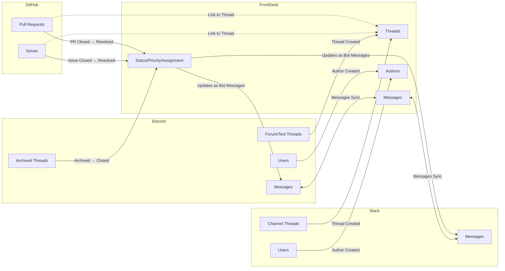

# FrontDesk Integration Sync

FrontDesk acts as a central hub for managing support threads across multiple platforms. This document explains how data synchronizes between FrontDesk and its integrations (Discord, Slack, and GitHub).

## Architecture Overview

FrontDesk uses a **Live State** pattern with WebSocket connections for real-time synchronization:

- **API Server** - Maintains the central database and Live State router
- **Discord Bot** - Node.js bot using Discord.js SDK
- **Slack Bot** - Node.js bot using Bolt framework
- **GitHub App** - Receives webhooks for issue/PR events

All integrations connect to the API's WebSocket server for real-time data sync.

## Sync Flow Diagram



## Sync Behavior by Integration

### Discord

| Direction           | Feature          | Behavior                                                           |
| ------------------- | ---------------- | ------------------------------------------------------------------ |
| Discord → FrontDesk | Thread Creation  | New thread in selected channel creates FrontDesk thread            |
| Discord → FrontDesk | Messages         | Messages sync to FrontDesk with `origin: "discord"`                |
| Discord → FrontDesk | Authors          | New users create author records with `metaId: "discord:{userId}"`  |
| Discord → FrontDesk | Archived Threads | Sets FrontDesk thread status to Closed (3)                         |
| FrontDesk → Discord | Messages         | Messages sent via webhook to Discord thread                        |
| FrontDesk → Discord | Status Updates   | Posts formatted bot message (does not change Discord thread state) |

**Backfill:** When a channel is added to an integration, existing threads are backfilled via a BullMQ queue with rate limiting.

### Slack

| Direction         | Feature         | Behavior                                                        |
| ----------------- | --------------- | --------------------------------------------------------------- |
| Slack → FrontDesk | Thread Creation | New message (without `thread_ts`) creates FrontDesk thread      |
| Slack → FrontDesk | Messages        | Messages sync to FrontDesk                                      |
| Slack → FrontDesk | Authors         | New users create author records with `metaId: "slack:{userId}"` |
| FrontDesk → Slack | Messages        | Messages sent via `chat.postMessage` API                        |
| FrontDesk → Slack | Status Updates  | Posts formatted bot message to thread                           |

### GitHub

| Direction          | Feature          | Behavior                                    |
| ------------------ | ---------------- | ------------------------------------------- |
| GitHub → FrontDesk | Issue Closed     | Sets linked thread status to Resolved (2)   |
| GitHub → FrontDesk | PR Closed/Merged | Sets linked thread status to Resolved (2)   |
| GitHub → FrontDesk | Issue/PR Linking | Issues and PRs can be linked to threads     |
| FrontDesk → GitHub | —                | **Not implemented** (read-only integration) |

## Sync Behavior Summary

| Action                     | Result                                                  |
| -------------------------- | ------------------------------------------------------- |
| Create thread on Discord   | Creates thread on FrontDesk                             |
| Create thread on Slack     | Creates thread on FrontDesk                             |
| Create thread on FrontDesk | Does NOT create on Discord/Slack                        |
| Send message on Discord    | Syncs to FrontDesk                                      |
| Send message on Slack      | Syncs to FrontDesk                                      |
| Send message on FrontDesk  | Syncs to Discord/Slack (via webhook)                    |
| Close thread on FrontDesk  | Posts update message to Discord/Slack (not status sync) |
| Archive thread on Discord  | Sets FrontDesk status to Closed                         |
| Close issue on GitHub      | Sets linked FrontDesk thread to Resolved                |
| Close PR on GitHub         | Sets linked FrontDesk thread to Resolved                |
| Change status on FrontDesk | Does NOT close Discord thread or GitHub issue           |

## Key Technical Details

### External IDs

Each entity stores references to its external platform:

- **Thread**: `externalId` (Discord thread ID or Slack message timestamp)
- **Thread**: `externalOrigin` ("discord", "slack", "github")
- **Thread**: `externalIssueId` / `externalPrId` (format: `github:owner/repo#123`)
- **Message**: `externalMessageId` (Discord message ID or Slack timestamp)
- **Author**: `metaId` (format: `platform:platformUserId`)

### Replication Prevention

Updates include a `replicatedStr` JSON field tracking which platforms have already replicated the change:

```json
{
  "discord": "message_id",
  "slack": "timestamp",
  "github": true
}
```

This prevents infinite sync loops where a change triggers a notification that triggers another change.

### Live State Subscriptions

Integrations use reactive subscriptions to detect changes:

```typescript
// Watch for messages needing sync to Discord
store.query.message
  .where({
    externalMessageId: null,
    thread: { discordChannelId: { $not: null } },
  })
  .subscribe(handleMessages);
```

### Rate Limiting

- **Discord**: BullMQ queue with 10 jobs/minute limit
- **Slack**: Standard Slack API rate limits
- **GitHub**: Standard GitHub API rate limits (5000 req/hour authenticated)

## Key Files

| File                                | Purpose                    |
| ----------------------------------- | -------------------------- |
| `apps/api/src/live-state/schema.ts` | Central data schema        |
| `apps/discord/src/index.ts`         | Discord bot main logic     |
| `apps/discord/src/lib/queue.ts`     | BullMQ backfill queue      |
| `apps/slack/src/index.ts`           | Slack bot main logic       |
| `apps/github/src/webhooks/index.ts` | GitHub webhook handlers    |
| `packages/schemas/src/integration/` | Integration config schemas |
